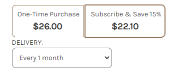

# Customization Recipes

Below are common ways to customize a BigCommerce front-end to incorporate ReCharge elements.

## Product Page (Standard)
1. Navigate to the store's [Theme Files](https://support.bigcommerce.com/s/article/Stencil-Themes#edit)
2. Locate the product page template file
3. Add the class `rca-subscription` to a div that you would like to be used as the anchor for the ReCharge Subscription Selection Widget. 
* See (`rca-subscription`)[#]
> Note: This will overwrite the contents of the div 

## Subscription Text
1. Change “Delivery” to “Frequency” - some stores don’t deliver a product, such as when a store is collecting a recurring donation, and would like to change the subscription text from “Delivery” to “Frequency”

2. Use a jQuery selector such as `$('#recharge-subscription > label')` to select the **Delivery** label
3. Update the label text with jQuery

```js
$('#recharge-subscription').click(function() {
    $('#recharge-subscription > label').html(function () {
    return $(this).html().replace("Delivery", "Frequency");
    });
});
```
## Cart 
Add a "Product Subtotal” cart subtotal additional custom field - some stores would like to show a field like “Product Total”


1. Add  `class rca-cart-subtotal` to the cart totals subtotal row HTML element that contains cart subtotal fields.
2. Add class `rca-cart-subtotal-label` to the cart totals subtotal row’s label HTML element.
3. Add class `rca-cart-subtotal-value` to the cart total subtotal row’s value HTML element.

## Checkout Handoff
1. Add the class `rca-checkout-button` [dev IP on rca-checkout-button class] to every instance of the checkout button. This will do the following:
  * If there is a subscription product in the cart, the user will be directed to ReCharge Checkout.
  * If there are NO subscription products in the cart, the user will be direct to the normal BigCommerce Checkout

## Customer Portal
1. Add the class `rca-account-navbar-section` to the Account sub-menu `<ul>` element.


This will inject a **Manage Subscriptions** link into the **Account** menu for logged in Users.

## Category
1. Add the class `rca-productGrid` to the BigCommerce Product Grid `<ul>` element.
<br>


