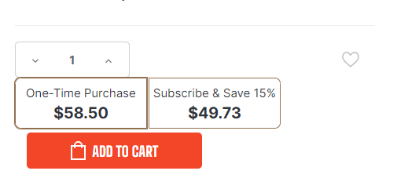
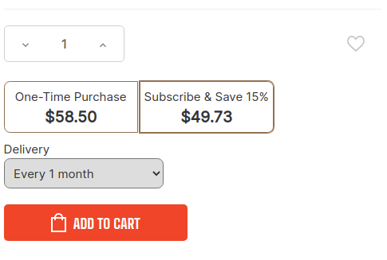
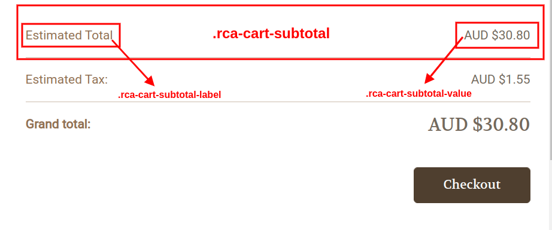
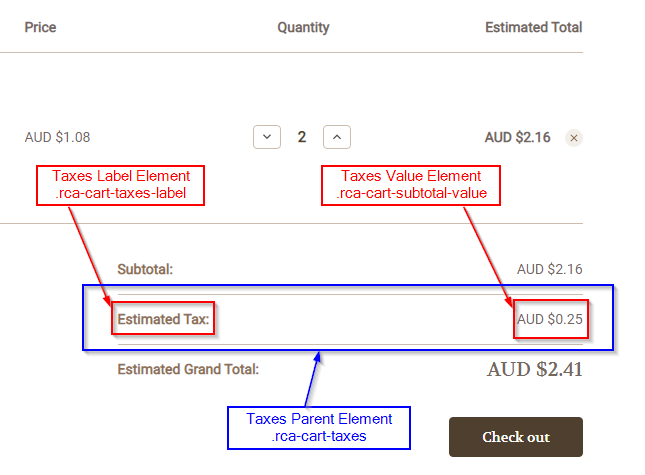
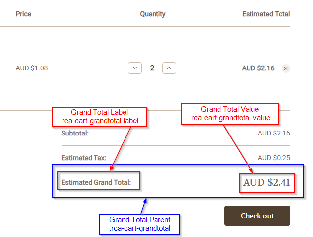
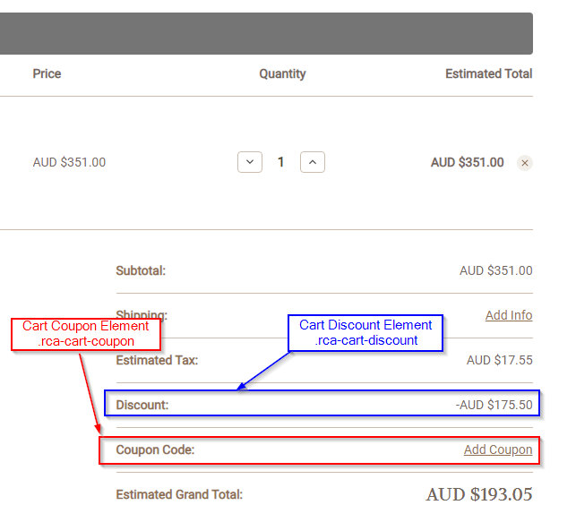
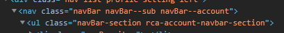
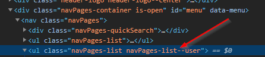
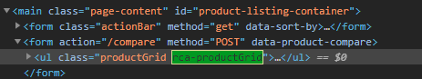

# Frontend Customization Recipes

The ReCharge BigCommerce integration is customizable to fit the needs of your customers. You can tailor the way ReCharge subscription elements look on BigCommerce storefronts. This article contains CSS and JavaScript "recipes" for creating certain functionality or adjust the ReCharge elements on your storefront.

## CSS Class Recipes

### Adding subscription widget to product page
1. Navigate to the store's [Theme Files](https://support.bigcommerce.com/s/article/Stencil-Themes#edit)
2. Locate the product page template file
3. Add the class `rca-subscription` to a div that you would like to be used as the anchor for the ReCharge Subscription Selection Widget. 
> Note: This will overwrite the contents of the div 

### Styling the subscription product widget

You can add CSS rules to adjust the uniformity of spacing for the subscription widget.


1. Increase `margin-top` and `margin-bottom` of the `.rca-subscription-form` class to a desired amount to separate the widget from quantity selector and add to cart button.
2. Add `margin-bottom: 10px` to the `.rca-subscription-form-buttons` class to adjust the height of the subscription frequency selector).
3. Add `margin-left: 0` to the `.rca-subscription` class to move add-to-cart button left

The widget should look like this:


To align the subscription selector with the product quantity dropdown:
1. Add `display: flex` to the `.productView-options` > form element
2. Move `div.rca-subscription` outside of and below of `.productView-options` > `form` element.
3. Increase the CSS height of quantity increase/decrease buttons, and adjust margins to the desired sizes

### Localizing subscription text

You can localize subscription widget text to support other languages or types of products that don't require delivery. Doing this involves changing the values of properties in the `RCA_LOCALES` object.

```js
const RCA_LOCALES = {
locales: {
    en: {
      "accounts": {
        "manage_subscriptions_label": "Manage Subscriptions"
    },
    "products": {
        "one_time_purchase_label": "One-Time Purchase",
        "subscription_label": "Subscription",
        "subscribe_and_save_label": "Subscribe & Save",
        "subscribe_and_save_extended_label": "on every recurring order",
        "subscribe_and_save_frequency_label": "Delivery"
    },
    "cart": {}
    },
  },
}
```

Localization of the storefront as a whole can be done by manipulating the BigCommerce Stencil `en.json` file. See [Translation Keys](https://developer.bigcommerce.com/stencil-docs/localization/translation-keys) for more information.

Add `lang` to `RCA_LOCALES` then set to `en` (currently the only key supported).

```js
const RCA_LOCALES = {
    lang: 'en',
}
```

You can also test localization without a language file (e.g. es.json) by adding the language strings to the `RCA_LOCALES` object.

```js
const RCA_LOCALES = {
  lang: "es",
  locales: {
    es: {
      accounts: {
        manage_subscriptions_label: "Administrar desde la configuración",
      },
      products: {
        subscribe_and_save_label: "Suscribir & Salvar",
        subscribe_and_save_extended_label: "en cada orden recurrente",
        subscribe_and_save_frequency_label: "entrega",
      },
      cart: {},
    },
  },
};
```

### Custom subscription text
If you want to just change the wording contained in the subscription widget, you can use frontend logic. Here is an example with JQuery, where you will select the `Delivery` `label` and and update it.

```js
$('#recharge-subscription').click(function() {
    $('#recharge-subscription > label').html(function () {
    return $(this).html().replace("Delivery", "Frequency");
    });
});
```
## Cart 

### Including cart totals

The cart totals element contains all of the line items in a cart. The total order value is derived from the cart totals. This parent element is designated with the `rca-cart-totals` class. Ensure this class is present on cart element as we observe this class for cart changes.


### Set subtotal elements in a cart

The following steps will allow you to add subtotals to a cart


1. Add  `class rca-cart-subtotal` to the cart totals subtotal row HTML element that contains cart subtotal fields.
2. Add class `rca-cart-subtotal-label` to the cart totals subtotal row’s `label` HTML element.
3. Add class `rca-cart-subtotal-value` to the cart total subtotal row’s `value `HTML element.

### Set taxes elements in a cart

To include order tax elements in the cart:

1. Add the class `rca-cart-taxes-label` to your taxes label element
2. Add the class `rca-cart-taxes-value` to your taxes value element
3. Add the class `rca-cart-taxes` to the parent `div` of your taxes value and taxes label elements.



By default ReCharge sets the taxes label to say "Estimated Tax" on the `rca-cart-taxes-label` element. We also calculate taxes from the `rca-cart-taxes-value` element. 

### Add grand total elements to the cart

To add order grand total elements to the cart:

1. Add the class `rca-cart-grandtotal-label` to your grand total label element
2. Add the class `rca-cart-grandtotal-value` to your grand total value element
3. Add the class `rca-cart-grandtotal` to the parent div of your grand total value and grand total label elements.

We update the grand total label on the cart page to say “Estimated Grand Total" (by default). We also get the grand total value for calculations from the grand total value element.



### Setting discounts and coupons in the cart
To add coupon elements to the cart:

1. Add the class `rca-cart-discount` to the cart discount parent element
2. Add the class `rca-cart-coupon` to the cart coupon parent element 



### Adding line items to cart
ReCharge observes the line items in a cart to keep track of changes to these totals and to track the subscription items still in cart. If the ReCharge Adapter fails to update with these changes, you can ensure this functionality by adding these elements:

  1. Add the class `rca-cart-items` to the line item parent element
  2. Add the class `rca-cart-item` to each line item element
  3. Add the class `rca-cart-item-price` to each Line item price element
  4. Add the class `rca-cart-item-quantity` to each line item quantity element
  5. Add the class `rca-cart-item-total` to each line item total element
  6. Add the class `cart-item-name` to each line item product name element (This sets the anchor point for subscription messaging in the cart)
  7. Add the class `rca-cart-remove` to each remove the item button element.

  

  > **Hiding Elements**
  > Add `rca-cart-hide-subscription` to every element you wish to hide when there is a subscription element in the cart. E.G. Hidinh Google Pay when subscription products are in the cart.


### Checkout redirect for subscription products
You can add the `rca-checkout-button` to the checkout button in order to direct a user to the ReCharge checkout when there is a subscription product in a customer's cart. When this class is added to the button and there aren't any subscription products present in the cart, the user will proceed to the normal BigCommerce Checkout.

## Adding the ReCharge customer portal link to store menu
Do the following to add a menu item for the ReCharge customer account portal:

- Add the class `rca-account-navbar-section` to the Account sub-menu `<ul>` element.



Now you've injected the  **Manage Subscriptions** link into the **Account** menu for logged in users. For more on BigCommerce users, see [Customer Storefront Accounts](https://support.bigcommerce.com/s/article/Customer-Account-Creation)

## Category
To include the ReCharge Subscription elements to a category, add the class `rca-productGrid` to the BigCommerce Product Grid `<ul>` element
<br>


## Javascript Customization Stories
### Custom add-to-cart button
You can create a custom add-to-cart button for a chosen product and subcription frequency using the following JavaScript example:


1. Add the element to a button with the class `.bc-btn--add_to_cart` 

2. When it is clicked, fire the function...

```js
function addToCartCallback(product, subscriptions)` 
```
...Which will add the desired product to a cart. You can adjust the arguments passed in the to your specific use case.

