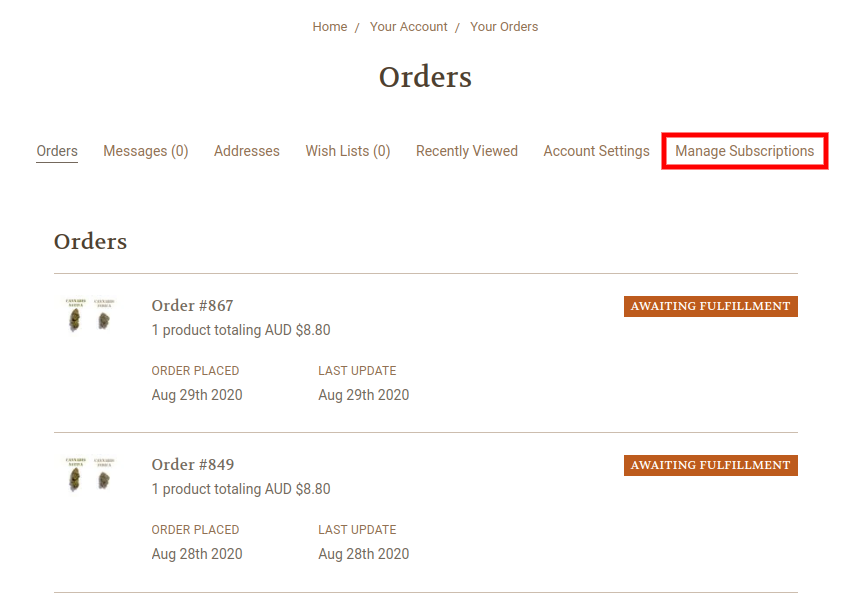

# Classes
## ReCharge Class Groups
|Class|Group|Description|Screenshot|Code Logic|
|-|-|-|-|-|
|`rca-productGrid`|Category|Category page product listings.|||
|`rca-category-price`|Category|Category page - product preview - product price||This class is used for calculating price of subscription item under discount|
|`rca-product-price`|Product|Product price on product page.||This class is used for calculating price of subscription item under discount|
|`rca-cart-dropdown-price`|Cart Dropdown|Cart dropdown line price||This class is used for replacing the subscription item’s original price with ReCharge subscription discounted price|
|`rca-cart-modal-price`|Cart Modal|Cart modal product's line price||This class is used for replacing the subscription item’s original price with ReCharge subscription discounted price|
|`rca-cart-modal-sub-text`|Cart Modal|Cart modal product's subscription info||This class is used as a selector for product subscription information|
|`rca-cart-modal-subtotal`|Cart Modal|Cart modal subtotal price||Changes subtotal value when subscription item is in cart|
|`rca-cart-header-subtotal-label`|Cart|Cart grid header total column|||
|`rca-cart-shipping`|Cart|Cart totals shipping row||Hide shipping row when subscription is present|
|`rca-cart-taxes`|Cart|Cart totals tax row||Hide tax row when subscription is present|
|`rca-cart-taxes-label`|Cart|Cart totals tax label|||
|`rca-cart-taxes-value`|Cart|Cart totals tax value|||
|`rca-cart-subtotal`|Cart|Cart totals subtotal row|||
|`rca-cart-subtotal-label`|Cart|Cart total subtotal label|||
|`rca-cart-subtotal-value`|Cart|Cart totals subtotal value||Changes subtotal value when subscription item is in cart|
|`rca-cart-grandtotal`|Cart|Cart totals  grandtotal row|||
|`rca-cart-grandtotal-label`|Cart|Cart totals grand total label||Changes text to Estimated Grand Total on Cart Page|
|`rca-cart-grandtotal-value`|Cart|Cart totals grandtotal value||Changes grandtotal value when subscription item is in cart|
|`rca-cart`|Cart|Cart line items table||This class makes locating specific elements in cart easier and more precise|
|`rca-cart-item`|Cart|Cart line item wrapper||We are injecting this class into every line item table row in Cart page.
|`rca-cart-item-price`|Cart|Cart line price’s price per item||We are injecting this class into price per item element of each line item row in Cart table to update the price to discounted value (if discount is applicable)|
|`rca-cart-item-total`|Cart|Cart line item price||We are injecting this class into line item price element of each line item row in Cart table to update the price to discounted value (if discount is applicable)|
|`rca-cart-item-quantity`|Cart|Cart line item quantity input field||We are injecting this class into quantity input element of each line item row in Cart table to track changes of item’s quantities|
|`rca-cart-line-item-subscribe`|Cart|Cart line item’s subscription text||We are injecting this class to subscription info text of each line item row in Cart table that has subscription applied to it|
|`rca-cart-discount`|Cart|Cart totals discount row||Hide discount row when subscription is present|
|`rca-cart-coupon`|Cart|Cart totals coupon row||Hide coupon row when subscription is present|
|`rca-cart-banner`|Cart|||Hide banner when subscription is present|
|`rca-cart-remove`|Cart|Cart line item remove button||We are injecting this class into remove from cart buttons in each line item row inside Cart page table to track cart changing behavior.|
|`rca-manage-subscriptions`|All|Navigation bar||We are injecting this class into the menu to serve as an anchor for our Manage Subscriptions link|
|`rca-manage-subscriptions`|All|Manage subscriptions navigation bar link. Only appears if customer has purchased a subscription item||We are injecting this class into manage subscriptions link in navbar’s account tab|
|`rca-remove-element`|All|Class to be added to elements you wish to be removed||We are injecting this class into all elements that are to be removed from DOM|
|`rca-hide-element`|All|Class to be added to elements you wish to be hidden||We are injecting this class into all elements that are to be hidden from DOM but not removed.
|`rca-subscription`|Product|Class where the Product subscription selection widget is inserted.||If the product is a subscription and one-time product, show the selection widget (as in image **1**). If the product is a one-time only or subscription only product, show the selection widget with ONLY the frequency selector visible(as in image **2**)|


## Attributes
|Attribute|BigCommerce Placement|Class Placement|Values|Description|Screenshot|
|-|-|-|-|-|-|
|`rca-subs-form-input-type`|ProductView Options (`.productView-options`)|**TBD**|button, checkbox, or radio|The type of input to display in product views for selecting subscription options.||
|`rca-subs-form-initial-frequency`|ProductView Options (`.productView-options`)|**TBD**|A number of periods (days, weeks, months).|The subscription frequency to default to in product views for selecting subscription options.||

## Appendix
### ReCharge Class Structure

```js
header_subtotal_label: CustomClass = CustomClass(
        custom_class='rca-cart-header-subtotal-label',
        selectors=['.cart-header-item:contains("Total")'],
        group='cart'
    )
    shipping_label: CustomClass = CustomClass(
        custom_class='rca-cart-shipping-label',
        selectors=['.cart-total-label:contains("Shipping")'],
        group='cart'
    )
    taxes_label: CustomClass = CustomClass(
        custom_class='rca-cart-taxes-label',
        selectors=['.cart-total-label:contains("Tax")'],
        group='cart'
    )
    taxes: CustomClass = CustomClass(
        custom_class='rca-cart-taxes',
        selectors=['.cart-total-label:contains("Tax") + div > span'],
        group='cart'
    )
    subtotal_label: CustomClass = CustomClass(
        custom_class='rca-cart-subtotal-label',
        selectors=['.cart-total-label:contains("Subtotal")'],
        group='cart'
    )
    subtotal: CustomClass = CustomClass(
        custom_class='rca-cart-subtotal',
        selectors=['.cart-total-label:contains("Subtotal") + div > span'],
        group='cart'
    )
    grandtotal_label: CustomClass = CustomClass(
        custom_class='rca-cart-grandtotal-label',
        selectors=['.cart-total-label:contains("Grand Total") + div > span'],
        group='cart'
    )
    grandtotal: CustomClass = CustomClass(
        custom_class='rca-cart-grandtotal',
        selectors=['.cart-total-grandTotal'],
        group='cart'
    )
    grandtotal_order: CustomClass = CustomClass(
        custom_class='rca-grandtotal',
        selectors=['.cart-total-grandTotal'],
        group='cart',
        parentLevel=1
    )
    cart_line_item: CustomClass = CustomClass(
        custom_class='rca-cart-item',
        selectors=['[data-item-row]'],
        group='cart'
    )
    discount: CustomClass = CustomClass(
        custom_class='rca-cart-discount',
        selectors=['.cart-total-label:contains("Discount")'],
        group='cart',
        parentLevel=1
    )
    coupon: CustomClass = CustomClass(
        custom_class='rca-cart-coupon',
        selectors=['.cart-total-label:contains("Coupon")'],
        group='cart',
        parentLevel=1
    )
    banner: CustomClass = CustomClass(
        custom_class='rca-cart-banner',
        selectors=['.alertBox'],
        group='cart'
    )
    cart_remove: CustomClass = CustomClass(
        custom_class='rca-cart-remove',
        selectors=['.cart-remove'],
        group='cart'
    )
    product_price: CustomClass = CustomClass(
        custom_class='rca-product-price',
        selectors=['.productView-price > .price-section > [data-product-price-with-tax]'],
        group='product'
    )
    product_grid: CustomClass = CustomClass(
        custom_class='rca-productGrid',
        selectors=['.productGrid'],
        group='category'
    )
    nav_user: CustomClass = CustomClass(
        custom_class='rca-navUser',
        selectors=['.navUser']
    )
    generic_hide: CustomClass = CustomClass(
        custom_class='rca-remove-element',
        selectors=[]
        ```