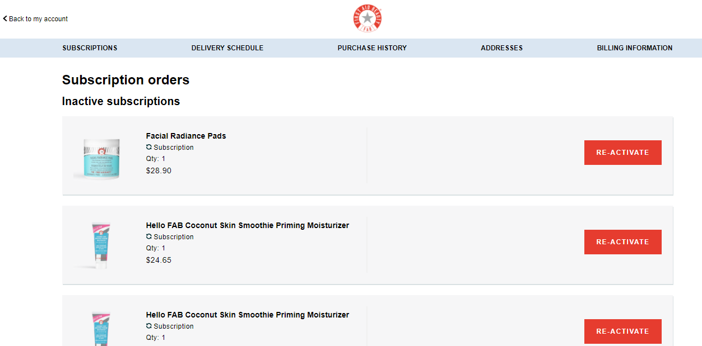

# Customer Portal

You'll find the ReCharge Customer Portal linked from a customer's account page. A link titled **Manage Subscriptions** will appear on the Account page if the customer has subscription orders. This will work out of the box. We recommend waiting to build a customized Customer Portal until your subscription program grows in size.

## Portal Functionality

Customers can take the following actions via the ReCharge portal:
* **Subscriptions** - view, cancel, reactivate, edit (change next charge date, change product quantity, change delivery schedule, update payment info, edit addresses)
* **Delivery Schedule** - view, skip, edit (change next charge date, change product quantity, change delivery schedule, update payment info, edit addresses)
* **Purchase History** - view
* **Customer Addresses** - update address
* **Billing Info** - view, edit

> The BigCommerce ReCharge Customer Portal doesn't support the ability to add or swap products at this time.