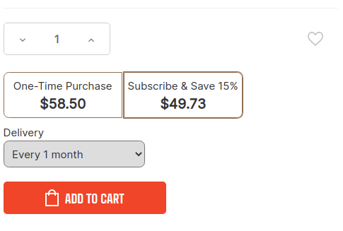

# BigCommerce Storefront

The Recharge frontend works in the following key ways:
* We leverage a CDN to serve content to your frontend that we then cache in browser local storage upon initial site load.
* Recharge provides - JavaScript Interfaces
* Additional details on storefront functionality is in the Common/Expected FE Functionality page

## Fast
This implementation is geared toward developers who want to quickly integrate ReCharge with BigCommerce and don't need any custom functionality.

Once you've installed the BigCommerce/ReCharge integration, you'll see the ReCharge subscription widget right out of the box.

ReCharge works with the [Cornerstone](https://support.bigcommerce.com/s/article/Cornerstone-Theme-Manual) theme out of the box. We are developing support for additional themes, however the widget may work with other themes. Confirm by making sure that your front end displays the functionality shown in the [Expected BigCommerce Frontend article](docs/bigcommerce-functionality.md).
If you do not see these ReCharge elements, you'll need to customize your storefront.

## Custom Storefront

This document will describe the technical components and steps that a BigCommerce developer would use to customize their BigCommerce storefront, or for themes not currently supported by ReCharge out of the box, while using ReCharge subscriptions.

This document assumes that the Recharge adapter has already been installed 
(Purchase/Install Recharge for BigCommerce) on the BigCommerce store. This means that Recharge has a corresponding Recharge store, has the BigCommerce store API keys, and has installed the JavaScript files on the BigCommerce store (in the script manager, the BC -Recharge Script and BC-Recharge Data Script).

General Configuration of Recharge must occur before subscriptions will show on your storefront.

The Common/Expected FE Functionality section will tell you what features should be enabled on your store to make subscriptions work as expected. However, you can customize as you see fit by leveraging the approaches in this documentation.

This document contains 3 sections:
* **Customization Stories** - Examples of common customizations and the steps to accomplish the story
* **ReCharge CSS Classes** - used for unsupported themes (BigCommerce buttons/objects/data attributes/classes have different selectors than Cornerstone) with standard flows
  * **Recharge CSS Class Groups** - Sections of BigCommerce that have ReCharge classes applied for subscription functionality  
  * **Required Classes** - The classes that must exist in the BigCommerce page to leverage ReCharge functionality
  * **CSS Attributes** - The attributes that can be added in the BigCommerce page to leverage ReCharge functionality
* Javascript Interfaces - used for custom themes with custom flows when you want full control of subscription cart and checkout process (e.g. the checkout button should take the customer to a free sample selection flow instead of to checkout, a sample selection button could then take the user to the checkout)

