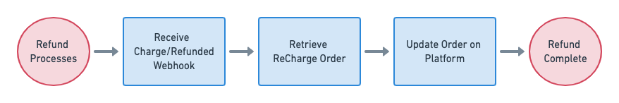

# Processing Refunds
We recommend syncing refunds processed via ReCharge with your external system to avoid conflicting order infromation.

## 1. Receiving the charge/refunded webhook

Your application can listen for the `charge/refunded` webhook which alerts a refund occurred. There are two statuses for this hook:

- `STATUS` == "refunded" indicates the order was entirely refunded
- `STATUS` == "partially_refunded" indicates the order was only partially refunded

## 2. Retrieve the ReCharge order
The `charge/refunded` payload contains an order `id`, allowing you to [retrieve the order record](https://developer.rechargepayments.com/#retrieve-an-order).

`GET` to `/orders/:order_id`

## 3. Update order on external platform

Using the order data you derived from step two, you can update the order record in your external system — adjusting line items or taxes, for example — as necessary