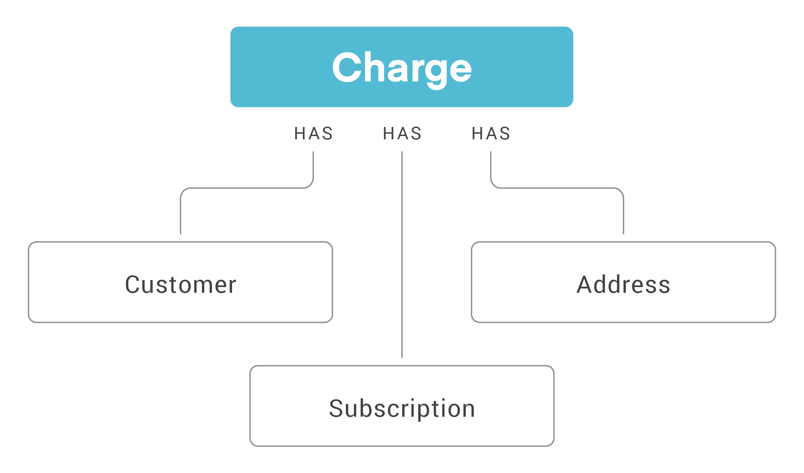

# Charges

|Scope|Description|
|-|-|
|`read_charges`| Required to retrieve a charge.|
|`write_charges`| Required to modify, skip and refund a charge.|
|`write_payments`| This scope is only needed when refunding a charge.|
|`process_charge`| Required to process charges in `queued` status.|

## What is a Charge?

A charge is a placeholder for an upcoming transaction and associated line items. The corresponding order (or orders in the case of prepaids) will be created once the charge is successful. After successful payment, the first order will be immediately submitted to the external platform if applicable (e.g. Shopify, BigCommerce).

Charges contain the actual amount a customer is charged for a product.

Some use cases for the Charges resource include:
- Processing a charge
- Finding a charge by customer, status or subscription

## Charges and Subscriptions
A Charge can have many parent subscriptions. All subscriptions on a given charge `scheduled_at` date will be merged into one charge and that charge will show the `subscription_id`s referenced in the `line_items` block.



## Use cases

<!--
type: tab
title: Retrieve a charge by customer_id
-->

`GET` to `https://api.rechargeapps.com/charges?customer_id=10101`

<!--
type: tab
title: Skip a charge
-->

`POST` to `https://api.rechargeapps.com/charges/:id/skip`

```js
{"subscription_id": "27363808"}
```
<!-- type: tab-end -->

## Resources
[Charges reference](https://developer.rechargepayments.com/#charges)