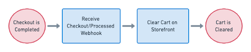

# Clearing the Cart
For user experience purposes, we recommend clearing the customer's cart on the external ecommerce platform or site after you've processed their order with ReCharge. This avoids any confusion the customer would experience if they returned to the storefront to see the items they've just purchased are still in the cart.

### 1. Receive checkout/processed webhook
Your application can listen for the `checkout/processed` webhook which confirms an order is successfully processed. 

### 2. Clear storefront cart
The `checkout/processed` payload contains the cart `id`. You can match this ID with the ecommerce platform's cart ID and make the API calls necessary to clear the cart.