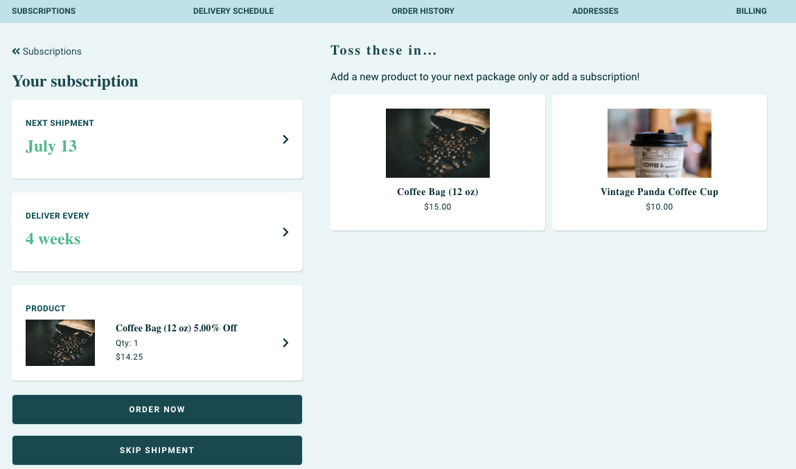

# Customer Portal

This article will provide a high-level overview for recreating the Customer Portal experience using our API integration. The ReCharge customer portal is where customers can manage aspects of their subscription, cancel their subscription or update their information.

There are two approaches to providing a Customer Portal with the API integration:

- ReCharge-Hosted Customer Portal (Recommended)
- Third-party customer portal

We recommend using the ReCharge-Hosted Customer Portal because redirecting a customer to this existing page requires minimal API calls and lets our existing infrastructure perform the technical heavy lifting of managing the customers' subscriptions.

However, if you require a fully bespoke experience for subscription management, you can use our REST APIs to perform updates to customer subscriptions yourself.
