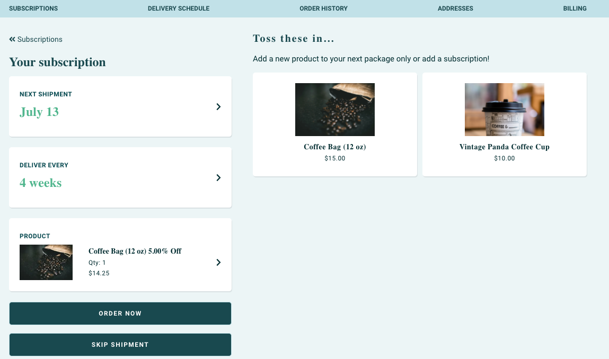
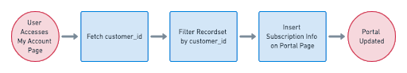

# Customer Portal

This article will provide a high-level overview for recreating the Customer Portal experience using our API integration. The ReCharge customer portal is where customers can manage aspects of their subscription, cancel their subscription or update their information.


There are two approaches to providing a Customer Portal with the API integration:

- ReCharge-Hosted Customer Portal (Recommended)
- Third-party customer portal

We recommend using the ReCharge-Hosted Customer Portal because redirecting a customer to this existing page requires minimal API calls and lets our existing infrastructure perform the technical heavy lifting of managing the customers' subscriptions.

However, if you require a fully bespoke experience for subscription management, you can use our REST APIs to perform updates to customer subscriptions yourself.

## ReCharge-Hosted Customer Portal
The ReCharge customer portal lets customers manage their subscriptions with minimal intervention from your application. 

This workflow involves inserting a *Manage Subscriptions* link somewhere in the existing platform's account page. When the customer loads this page, you will fetch the customer's hash, then compile a URL that redirects them to the portal.


### 1. Retrieve customer hash

When the customer arrives on their account page, use the [Customer API](https://developer.rechargepayments.com/#retrieve-a-customer) to look up the customer via your middleware. 

`GET` to `customers/:id`

You will receive a unique customer **hash** in the response.

### 2. Redirect to ReCharge portal
Once you have the customer hash, you can assemble a URL that redirects the customer to the ReCharge portal. Simple embed the link in a *Manage Subscriptions* menu item or similar.

### Example HTML redirecting to ReCharge customer portal

```html
<li>
  <a href="https://<recharge-subdomain>.admin.rechargeapps.com/portal/<customer_hash>/subscriptions">
    Manage Subscriptions
  </a>
</li>
```

## Third-party customer portal

This approach lets you handle the customer subscription management experience entirely independant of ReCharge. Use this approach if you want to fully customize the workflow and look/feel of the customer portal. In taking this approach you will leverage ReCharge's APIs and make calls necessary to update subscription and account records server-side when customers take action on the frontend.



### 1. Retrieve customer 

You will first need to filter all API calls to populate the portal with data by the `customer_id`. One method for retrieving the ID is applying a query parameter to the Customers endpoint.

**Example GET customer by email**

`GET` to `/customers?email=<customer_email>`

### 2. Filter resource by `customer_id`
Once you receive the `customer_id`, you can filter any applicable resource by this parameter. For example a `GET` to the `/subscriptions/` produces a response body with all subscriptions, including the `customer_id` for each.


**Example retrieve subscriptions**

`GET` to `/subscriptions/`

Response:

```json

{
  "subscription": {
    "id": 89559201,
    "address_id": 48563471,
    "analytics_data": {
      "utm_params": []
    },
    "cancellation_reason": null,
    "cancellation_reason_comments": null,
    "cancelled_at": null,
    "charge_interval_frequency": "30",
    "created_at": "2020-07-10T10:30:51",
    "customer_id": 43845860,
...
}
```
### 3. Populate manage subscriptions page with data

Now that you have the relevant information about a customer subscription, you can serve the information client-side. ReCharge's REST APIs provide access to a wide range of actions. For example, your application can take action to let customers edit, swap, cancel and update subscriptions using the method described.
