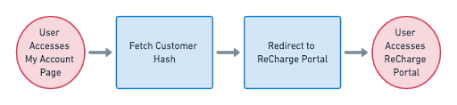

# ReCharge-Hosted Customer Portal
The ReCharge customer portal lets customers manage their subscriptions with minimal intervention from your application. 

This workflow involves inserting a *Manage Subscriptions* link somewhere in the existing platform's account page. When the customer loads this page, you will fetch the customer's hash, then compile a URL that redirects them to the portal.



### 1. Retrieve customer hash

When the customer arrives on their account page, use the [Customer API](https://developer.rechargepayments.com/#retrieve-a-customer) to look up the customer via your middleware. 

`GET` to `customers/:id`

You will receive a unique customer **hash** in the response.

### 2. Redirect to ReCharge portal
Once you have the customer hash, you can assemble a URL that redirects the customer to the ReCharge portal. Simply embed the link in a *Manage Subscriptions* menu item or similar.

### Example HTML redirecting to ReCharge customer portal

```html
<li>
  <a href="https://<recharge-subdomain>.admin.rechargeapps.com/portal/<customer_hash>/subscriptions">
    Manage Subscriptions
  </a>
</li>
```
