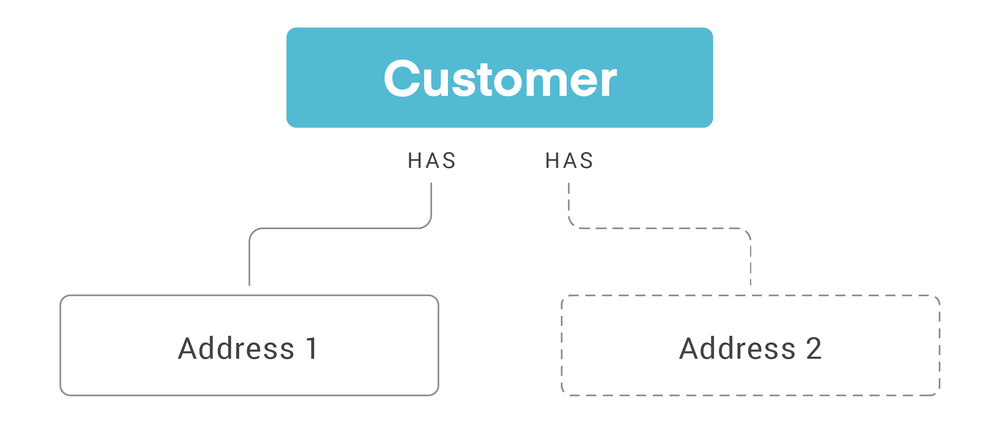

# Customers

## What is a Customer?

A Customer record is created within ReCharge when a shopper checks out on an ecommerce storefront with a ReCharge subscription. 

The Customer object contains key information such as:

- The customer's ReCharge `id`
- Billing information
- The external id associated with the customer on an ecommerce platform

<!-- theme: info -->
> Creating a customer within ReCharge will not create a customer record within an external ecommerce platform at this time.

## Scopes

|Scope|Description|
|-|-|
|`write customer`| Required to write to the customer record.|
|`write_payments`| This scope is only needed when creating or updating customer payment token information.|

## Customers and Addresses

The Addresses endpoint is a child of the Customer object. Customers can have many addresses associated with their account. Addresses cannot be associated with multiple customers. 

## Payment Method

Update the customer object to add or update a customer's payment method. ReCharge doesn't accept payment information such as the card number. You should send a tokenized customer representation from the payment processor.

## Use Cases

!--
type: tab
title: Some Content
-->

# Content!

Sweet, beautiful content, ready to blow your readers' minds.

<!--
type: tab
title: Some More Content
-->

# More Content!

With more mind-blowing material. Really. Just amazing, grade-A stuff.

<!-- type: tab-end -->

<!-- theme: warning -->
> ### Deprecated fields
>These fields are deprecated, however they will not be removed from this API version:
>|Deprecated field|Alternative|
>|-|-|
>|`product_title`|`title`|
>|`shipping_date`|`shopify_order_id`|
>|`address_is_active`|Ignore, field not applicable|

