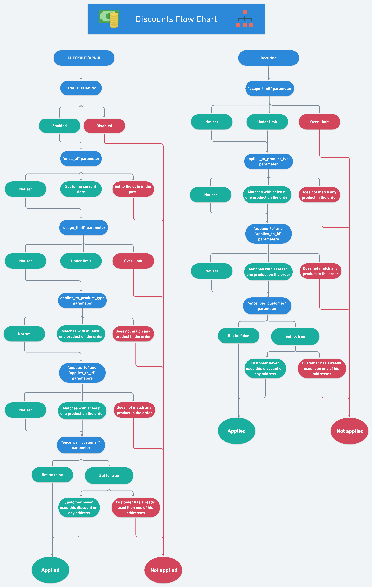

# Discounts
## What is a Discount?
ReCharge has its own discount engine to allow merchants to offer deals to customers. Discounts can be applied to a checkout, or applied directly to an address. Discounts can also be configured for recurring or single use on subscriptions.

Some use cases for the Discounts resource include creating discounts, updating the end date for discounts and restricting discounts to first-time customers only.

Discounts can be used in combination with [webhooks](webhooks-overview.md) to trigger a discount when customers meet certain order criteria. This method allows you to introduce more complex applications of discounts depending on your customers needs.

ReCharge discounts offer several rules. These can be used to narrow the conditions when discount applies:

- Minimum price
- Recurring use
- Single use
- Recurring use for a set amount of uses
- Start and end dates for subscription discounts


### Scopes
|Scope|Description|
|-|-|
|`read_discounts`| Required to retrieve a discount.|
|`write_discounts`| Required to write to the discounts record.|
|`write_addresses`| Only required to apply discounts to an address.|
|`write_orders`| Only required to apply discounts to an address.|



## Applying a discount to an address

You can now directly apply a discount to an addresses:

`POST` to `/addresses/:id/apply_discount`

Addresses can only have one discount applied. You cannot apply a discount if an existing queued charge in the address already has a discount.

## Applying a discount to a charge

You can now add a discount directly to a charge:

`POST` to `/charges/:id/apply_discount`

You cannot add another discount to an existing queued charge if the charge already has a discount.

<!-- theme: warning -->
> ### Charge discounts and regenerations
> If a charge has a discount and it gets updated or a regeneration occurs, the discount will be lost.
> Regeneration is a process that refreshes the charge JSON with new data when a subscription or address is updated.

> ### Note 
> You can provide either the `discount_id` or `discount_code`. If you pass both parameters, the `discount_id` value will override the value in `discount_code`.
## Use Cases

<!--
type: tab
title: Create a discount
-->

`POST` to `https://api.rechargeapps.com/discounts`

### Example request body

```json
{
  "applies_to_product_type": "ONETIME",
  "channel_settings": {
    "api": {
      "can_apply": false
    },
    "checkout_page": {
      "can_apply": true
    },
    "customer_portal": {
      "can_apply": true
    },
    "merchant_portal": {
      "can_apply": false
    }
  },  
  "code": "Discount",
  "discount_type": "percentage",
  "duration": "usage_limit",
  "duration_usage_limit" : 1,
  "ends_at" : "2023-12-31",
  "starts_at": "2018-05-16",
  "status": "enabled",
  "usage_limit": 1,
  "value": 12
}
```

<!--
type: tab
title: Apply a discount to an address
-->

`POST` to `https://api.rechargeapps.com/addresses/26031022/apply_discount`


```json
{
  "discount_id": 12406728
}
```

<!-- type: tab-end -->

## Resources
[Discounts reference](https://developer.rechargepayments.com/#discounts)