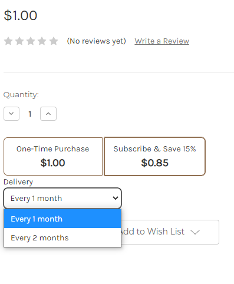
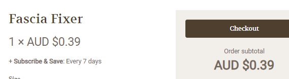
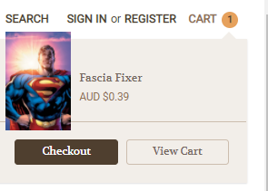
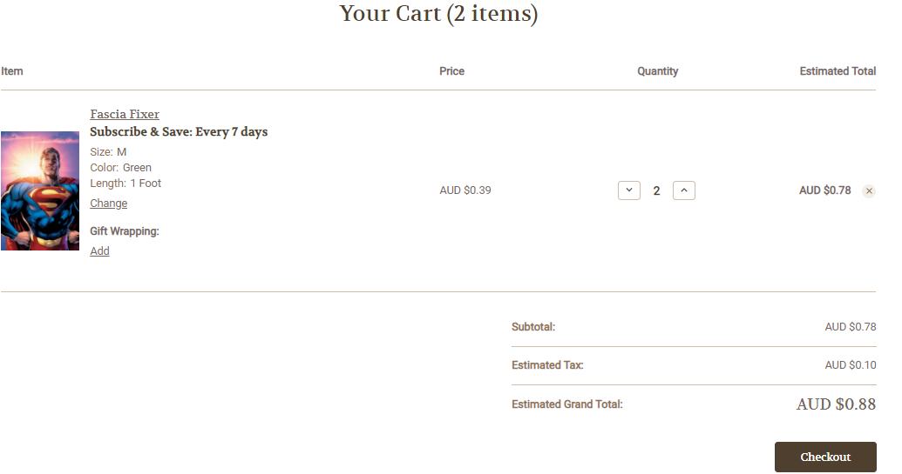
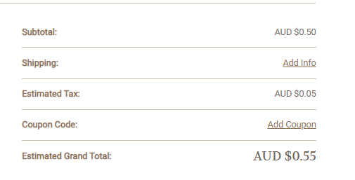
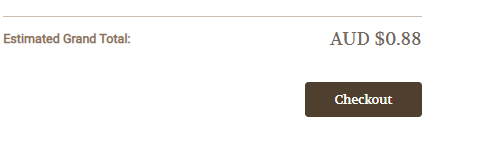
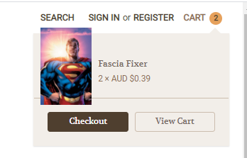
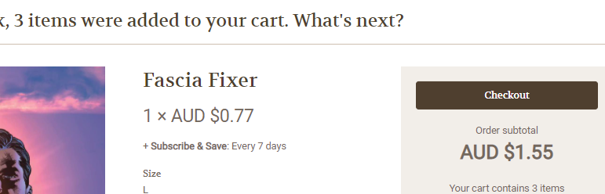
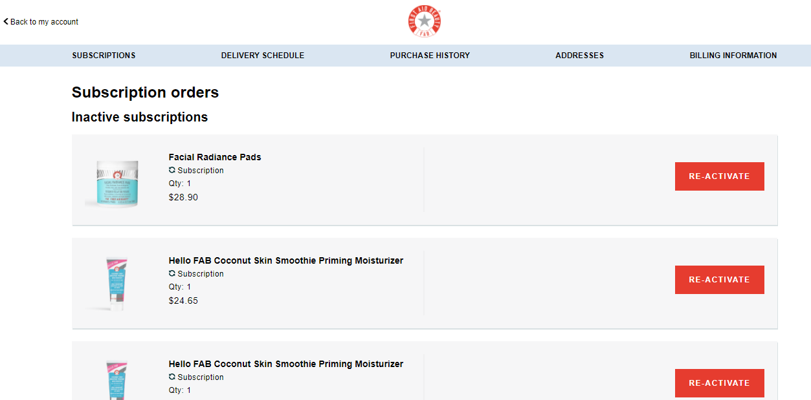

# Expected Front End Functionality

This reference displays what the ReCharge subscription widget should look like on a frontend. The ReCharge integration injects CSS elements onto various pages within a site.

## Frontend functionality
|Group|Frontend page/element|Image|Data displayed|Functionality|
|-|-|-|-|-|
|Product|Product page|| - Purchase options selector (Subscribe and one-time, sub only, prepaid)   - Subscription frequency with displayed text= Delivery   - Subscription discount|Add-to-cart functionality for subscriptions|
|Cart|Cart pop-up after add-to-cart||- Subscription frequency - Product subscription discounted price - Cart subtotal with discounted prices|Subscription checkout button|
|Cart|Cart preview (top right corner)||Product subscription discounted price if sub and save discount is present|Subscription checkout button|
|Cart|View cart summary||- Subscription frequency by product  * Only show “Subscription” if no discount is present. Show “Subscribe & Save” if discount is present  - Price: Product subscription discounted price - Estimated Total - Product line items total with discounted prices  - Subtotal: Cart subtotal with discounted prices - Estimated Tax: should be hidden Estimated Grand Total: Total based including sub and save discounts|Subscription checkout button|
|Cart|View cart summary (hidden fields)||- Hidden fields from cart compared with only one time products (OTPs): * Shipping * Coupon Code|Subscription checkout button|
|Checkout|Subscription checkout button||- If subscription items are present, redirect cart to Recharge checkout - Call the Bigcommerce Cart API endpoint to get all cart contents and call local storage for subscription info before posting combined cart data to Recharge
|Customer Portal|Account > Manage Subscriptions|||Link to Recharge hosted customer portal if the customer has subscriptions|
