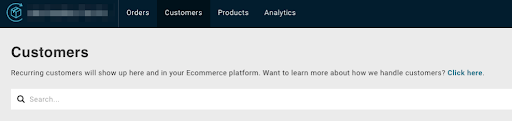

# Merchant Portal
As a developer, you have access to the ReCharge merchant portal. This is where you will manually setup your ReCharge store and configure store settings. See our customer documentation on [Settings](https://support.rechargepayments.com/hc/en-us/categories/360000578494-Other-Settings) for more information.

<!-- theme: warning-->
> ### Store setup
> You must configure store settings in the Merchant Portal to ensure there are no issues when using our API integration.

## URL

You can access the portal at the following URL

> `https://<store_subdomain>.admin.rechargeapps.com/customers`

## Actions

You can manually configure products, create customers and more using the Customer Portal. Some of these actions additionally include:

- Creating subscription products
- Adding and managing customers
- Setting up payment processor
- Setting up store taxes and shipping
- Analytics

More information about the Merchant Portal can be found in our [Knowledge Base](https://support.rechargepayments.com/hc/en-us/articles/360056632214-Getting-started-with-ReCharge).