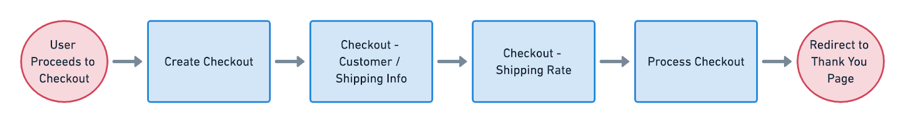

# Self-hosted Checkout
Use the self-hosted checkout approach to own the checkout process end-to-end. This solution builds on the [ReCharge hosted checkout](docs/recharge-hosted-checkout.md) flow. Instead of creating a checkout then redirecting the customer to ReCharge, you will redirect the customer to your own checkout pages and capture data about the checkout to send to ReCharge for processing.



## 1. Creating a Checkout
Like the ReCharge hosted checkout approach, you will build a checkout object using the items in an order:

### Example POST to /checkouts

```json
{
  "line_items": [
    {
      "charge_interval_frequency": 5,
      "cutoff_day_of_month": None,
      "cutoff_day_of_week": None,
      "expire_after_specific_number_of_charges": None,
      "fulfillment_service": "manual",
      "order_day_of_month": None,
      "order_day_of_week": None,
      "order_interval_frequency": 5,
      "order_interval_unit": "day",
      "product_id": <product_id>,
      "quantity": 6,
      "requires_shipping": True,
      "taxable": True,
      "variant_id": <variant_id>,
    }
  ],
}
```

## 2. Update Checkout with customer information
The next step is to send the customer to your custom checkout page once you've sent a `POST` to ReCharge creating the Checkout. Collect customer and address infromation from your CSS form fields, then update the Checkout object you created in Step 1.

### Example `PUT` to /checkouts/:id

```json
"shipping_address": {
      "address1": "6419 Ocean Front Walk",
      "address2": "Apt 2",
      "city": "Los Angeles",
      "company": "",
      "country": "United States",
      "first_name": "Novak",
      "last_name": "Djokovic",
      "phone": "1-800-800-8000",
      "province": "California",
      "zip": "90293"
    }
```

## 3. Retrieve shipping rates
After you have updated the checkout object, you can make a call to the shipping rates endpoint to retrieve all valid shipping rates for the customer. Shipping options can be set up in [shipping settings](https://support.rechargepayments.com/hc/en-us/articles/360008830553-Setting-up-shipping-for-subscription-products).


### `GET` to /checkouts/:id/shipping_rates

## 4. Set the shipping rate
Using the data from the `GET` to `shipping_rates`, populate the options onto your checkout page so the customer can select a shipping method.

### Example `PUT` to /checkouts/:id

```json
{
  "shipping_line": {
    "handle": "<handle from GET /checkout/TOKEN/shipping_rates>"
  }
}
```

## 5. Process Checkout

Finally, send a `POST` to the Checkouts API `charge` ednpoint to finalize processing checkout. It is best practice to present the customer with a page that allows them to review their final order before placing it. Once you've processed the checkout, redirect the customer to an order confirmation page.

### Example `POST` to checkouts/:id/charge

```json
{
  "payment_processor": "stripe",
  "payment_token": "<payment_token>",
  "payment_type": "CREDIT_CARD"
}
```