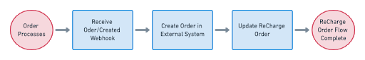
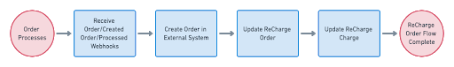

# Processing Orders

After ReCharge processes a subcription or checkout, our system will fire several webhooks you can use to sync the order to your external system.



Your system should listen for the following events:

- order/created
- order/processed
- order/updated

### 1. Receive order/created webhook

Once an order is processed, the `order/created` webhook will fire. If you receive a payload with `STATUS` == "SUCCESS" then this means you've successfully charged the customer and an order was created in the ReCharge system.

### 2. Push order to external system
After you complete step one and confirm the order, you can sync the order to your external system. The [webhook payload](https://developer.rechargepayments.com/#order) from the `order/created` event contains the data your application needs to construct an order for your external system, including billing, product and customer information.


### 3. Update order in ReCharge

Once you've pushed an order to your external system, you should [update the ReCharge order](https://developer.rechargepayments.com/#update-an-order) record with external order IDs. The following properties should be updated:

- `external_order_id` - This is the platform database unique order id (e.g. 92812948)
- `external_order_number ` - A customer-friendly order ID, (e.g. 101)

> **External order IDs**
> Note that on some platforms, only one ID may exist for both properties.

### Example update ReCharge order
 `PUT` to `/orders/:recharge_order_id`

 ```json
 {
  "external_order_id": "<platform_order_id>",
  "external_order_number": "<platform_order_number>"
}
 ```

 ## Processing prepaid orders

 The workflow for syncing prepaid subscription products to your external system differs from syncing regular subscription orders. With prepaids, customers are paying up front for multiple shipments.

 

### 1. Receive order/created OR order/processed webhook

When a prepaid order is successfully created and you receive either the `order/created` or `order/processed` webhook, confirm `STATUS` == "SUCCESS". This indicates the order was created in ReCharge successfully.

> **Initial and subsequent orders**
> For a prepaid order, `order/created` webhook indicates it is the first order of the prepaid and the `order/processed` webhook indicates it is a subsequent order of the prepaid to be fulfilled later.

### 2. Create order in external system
As with step two for normal subscription orders, your application should consume the payload for the `order/created` webhook and transform, then push, the data to your external system.

### 3. Update the ReCharge order

See step three above for updating the ReCharge order record.

### 4. Update the charge in ReCharge

Because this is a prepaid order, you must also update the [Charge record](https://developer.rechargepayments.com/#charges) with the `external_order_id`.

### Example update charge

`PUT` to `/charges/:recharge_charge_id`

```json
{
  "external_order_id": "<platform_order_id>"
}
```

