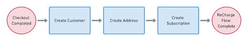

## Third-Party Checkout
This article will walk you through the steps for creating your own third-party checkout. This approach is the most customizable option for checking out customers with the ReCharge API integration and lets you own the entire process outside of ReCharge's system.

After processing the customer’s checkout with your third-party checkout experience, you will make calls to the ReCharge API to set up subscriptions for the recurring products the customer purchased. Using this workflow, your third-party checkout processes all initial purchases. ReCharge handles all subsequent recurring purchases.



## 1. Create customer
Using this checkout workflow, you will handle moving the customer through checkout **first**, then send data gathered during the checkout process to ReCharge.

The first step is creating a customer using the [Customers](https://developer.rechargepayments.com/#customers) API endpoint. When creating a customer, the following fields are required:
- Name
- Email 
- Billing address
- Vaulted payment processor token

### Example create customer

`POST` to `/customers`

```json
{
  "email": "example_mail@gmail.com",
  "billing_address1": "3030 Nebraska Avenue",
  "billing_city": "Los Angeles",
  "billing_country": "United States",
  "billing_first_name": "John",
  "billing_last_name": "Smith",
  "billing_phone": "1234567890",
  "billing_province": "California",
  "billing_zip": "90404",
  "first_name": "John",
  "last_name": "Smith",
  "stripe_customer_token": "<customer_payment_token>"
}
```

Your application can also retrieve an existing customer if they've made a previous purchase.


## 2. Create shipping address

The next step is creating the [shipping address](https://developer.rechargepayments.com/#the-address-object) in ReCharge that's tied to the customer's subscription delivery. If you created a new customer in the last step, you should have received an `id` in the callback. You will pass the customer `id` as part of the request URL.

### Example create shipping address

`POST` to `/customers/:id/addresses`

```json
{
  "address1": "1776 Washington Street",
  "city": "Los Angeles",
  "company": "ReCharge",
  "country": "United States",
  "first_name": "John",
  "last_name": "Smith",
  "phone": "5551234567",
  "province": "California",
  "shipping_lines_override",
  "zip": "90404",
}

```

## 3. Create subscription

The final step is creating a [Subscription](https://developer.rechargepayments.com/#create-a-subscription) in ReCharge. The subscription record contains information about when the customer gets billed, how often the item is shipped, and the date a customer is charged.

### Example create subscription

`POST` to `/subscriptions`

```json
{
  "address_id": <address_id>,
  "charge_interval_frequency":"30",
  "next_charge_scheduled_at":"2021-02-10",
  "order_interval_frequency":"30",
  "order_interval_unit":"day",
  "quantity":3,
  "Shopify_variant_id": <product_id>
}
```
