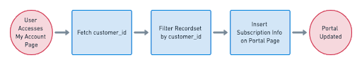

# Third-party customer portal

This approach lets you handle the customer subscription management experience entirely independant of ReCharge. Use this approach if you want to fully customize the workflow and look/feel of the customer portal. In taking this approach, you will leverage ReCharge's APIs and make calls necessary to update subscription and account records server-side when customers take action on the frontend.



### 1. Retrieve customer 

You will first need to filter all API calls to populate the portal with data by the `customer_id`. One method for retrieving the ID is applying a query parameter to the Customers endpoint.

**Example GET customer by email**

`GET` to `/customers?email=<customer_email>`

### 2. Filter resource by `customer_id`
Once you receive the `customer_id`, you can filter any applicable resource by this parameter. For example a `GET` to the `/subscriptions/` produces a response body with all subscriptions, including the `customer_id` for each.


**Example retrieve subscriptions**

`GET` to `/subscriptions/`

Response:

```json

{
  "subscription": {
    "id": 89559201,
    "address_id": 48563471,
    "analytics_data": {
      "utm_params": []
    },
    "cancellation_reason": null,
    "cancellation_reason_comments": null,
    "cancelled_at": null,
    "charge_interval_frequency": "30",
    "created_at": "2020-07-10T10:30:51",
    "customer_id": 43845860,
...
}
```
### 3. Populate customer portal page with data

Now that you have the relevant information about a customer subscription, you can serve the information client-side. ReCharge's REST APIs provide access to a wide range of actions. For example, your application can take action to let customers edit, swap, cancel and update subscriptions using the method described.

